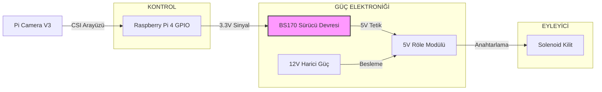
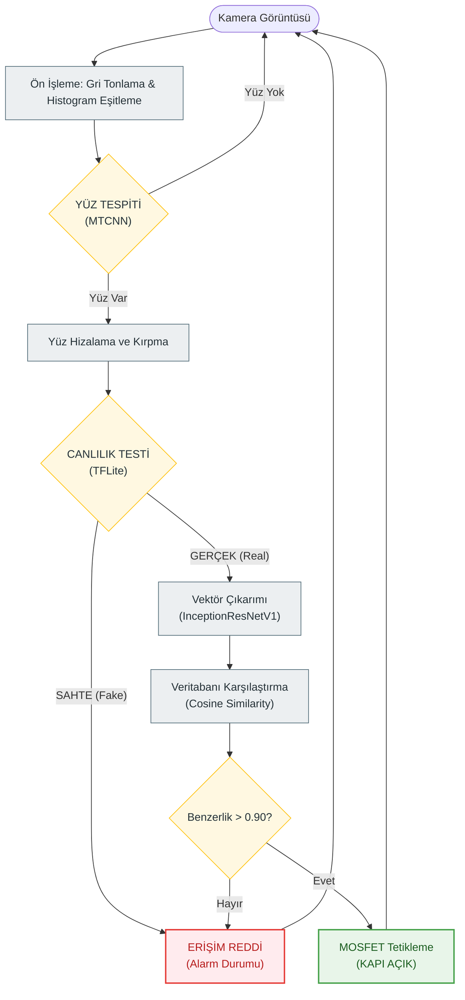

# Yüz Tanıma ve Canlılık Tespiti Tabanlı Gömülü Akıllı Kilit Sistemi
# (Smart Door Lock System Using Face Recognition & Liveness Detection)


## 📖 Proje Özeti (Abstract)

Bu proje, **Elektrik-Elektronik Mühendisliği** bitirme tezi kapsamında **Kemal Can Güngör** tarafından tasarlanmış ve prototiplenmiştir.

Geliştirilen sistem, biyometrik güvenlik uygulamalarının gömülü sistemler üzerinde gerçek zamanlı ve yüksek güvenilirlikle çalışabileceğini kanıtlayan bir **Akıllı Kapı Kilidi** projesidir. Sistem, **Raspberry Pi 4** mimarisi üzerinde, **Derin Öğrenme (Deep Learning)** algoritmalarını kullanarak çalışır.

Geleneksel yüz tanıma sistemlerinden farklı olarak, entegre edilen **TensorFlow Lite** tabanlı "Canlılık Tespiti" (Anti-Spoofing) modülü sayesinde; fotoğraf, video veya maske kullanılarak yapılan sızma girişimlerini engeller. Donanım tarafında ise, mikroişlemcinin 3.3V lojik çıkışlarını 12V endüstriyel yükleri sürecek şekilde yükselten özel bir **MOSFET sürücü devresi** tasarlanmıştır.

---

## ✨ Temel Özellikler (Key Features)

* **Uç Bilişim (Edge Computing):** Tüm yapay zeka işlemleri buluta ihtiyaç duymadan cihaz üzerinde yapılır, veri gizliliği (KVKK/GDPR) sağlanır.
* **Yüksek Doğruluk:** MTCNN ve InceptionResNetV1 mimarileri ile **%96.5** tanıma başarısı elde edilmiştir.
* **Anti-Spoofing (Canlılık Testi):** Sahte yüz girişimlerini (fotoğraf/ekran) **%96** oranında tespit edip engeller.
* **Endüstriyel Kontrol:** BS170 MOSFET ve opto-izole röle üzerinden 12V Solenoid kilit kontrolü sağlanır.
* **Otomatik Kalibrasyon:** Değişken ışık koşullarında histogram eşitleme ile görüntü optimizasyonu yapar.

---

## 🛠️ Sistem Mimarisi (System Architecture)

Proje, yazılım ve donanım katmanlarının sıkı entegrasyonuna dayanır.

### 1. Donanım Bileşenleri (Hardware Stack)
| Bileşen | Teknik Detay | Görevi |
| :--- | :--- | :--- |
| **İşlemci** | Raspberry Pi 4 Model B (4GB) | Ana kontrol ve yapay zeka işleme. |
| **Görüntüleme** | Pi Camera Module V3 (Sony IMX219) | Yüksek çözünürlüklü görüntü akışı. |
| **Eyleyici** | 12V DC Solenoid Kilit | Kapı mekanizmasını fiziksel olarak kilitler. |
| **Sürücü** | BS170 MOSFET + 5V Röle | 3.3V GPIO sinyalini 5V/12V güç hattına anahtarlar. |

#### Donanım Bağlantı Şeması (Wiring Diagram)
Aşağıdaki şema, sistemin güç ve veri yollarını göstermektedir:



### 2. Yazılım Teknolojileri (Software Stack)
* **Dil:** Python 3.x
* **Yüz Tespiti:** MTCNN (Multi-task Cascaded Convolutional Networks).
* **Öznitelik Çıkarımı:** InceptionResNetV1 (VGGFace2 Pre-trained).
* **Canlılık Analizi:** TensorFlow Lite (MobileNetV2).
* **Arayüz:** Tkinter (Multithreaded GUI).

---

## 🔄 Algoritma Akış Şeması (Methodology & Workflow)

Sistem, kameradan alınan her kareyi (frame) analiz ederek milisaniyeler içinde karar verir.

**(Karar Mekanizması Görselleştirmesi)**



---

## 📊 Performans Sonuçları (Performance Results)

Geliştirilen sistem, 1.050 farklı test senaryosu altında, endüstri standardı diğer yöntemlerle karşılaştırılmıştır.

| Yöntem | Doğruluk (Accuracy) | Hız (FPS) | Donanım Yükü | Canlılık Testi |
| :--- | :---: | :---: | :---: | :---: |
| **Bu Proje (MTCNN + InceptionResNet)** | **%96.5** | **~0.7 FPS** | **Orta** | **VAR** |
| Haar Cascade + LBPH | %82.0 | ~4.5 FPS | Düşük | YOK |
| HOG + SVM | %88.5 | ~3.0 FPS | Orta | YOK |
| CNN (VGG16 Tabanlı) | %92.0 | ~0.2 FPS | Çok Yüksek | YOK |

---

## 💻 Kurulum (Installation)

Projeyi Raspberry Pi ortamında çalıştırmak için aşağıdaki adımları izleyin.

1.  **Depoyu Klonlayın:**
    ```bash
    git clone [https://github.com/KemalCaan/Kemal-Can-Gungor-and-Ozan-Emre-Tunca-Graduation-Project.git](https://github.com/KemalCaan/Kemal-Can-Gungor-and-Ozan-Emre-Tunca-Graduation-Project.git)
    cd Kemal-Can-Gungor-and-Ozan-Emre-Tunca-Graduation-Project
    ```

2.  **Sanal Ortam Oluşturun:**
    ```bash
    python3 -m venv venv
    source venv/bin/activate
    ```

3.  **Bağımlılıkları Yükleyin:**
    ```bash
    pip install -r requirements.txt
    ```
    *(Not: PyTorch ve TensorFlow Lite'ın ARM mimarisi (Raspberry Pi) için uygun sürümlerinin kurulduğundan emin olun.)*

4.  **Uygulamayı Başlatın:**
    ```bash
    python raspberry_gui.py
    ```

---

## 👨‍💻 Geliştirici (Developer)

**Kemal Can Güngör**
* **Unvan:** Elektrik-Elektronik Mühendisi
* **Odak Alanları:** Gömülü Sistemler, IoT, Bilgisayarlı Görü, Kenar Yapay Zeka (Edge AI)
* **İletişim:** [LinkedIn Profilim](https://www.linkedin.com/in/kemal-can-g%C3%BCng%C3%B6r-4598b4234/) | [E-posta](mailto:kemalcangungor@hotmail.com)

---

## 📄 Lisans (License)

Bu proje akademik araştırma ve geliştirme amaçlı olup **MIT Lisansı** altında açık kaynak olarak sunulmuştur.
